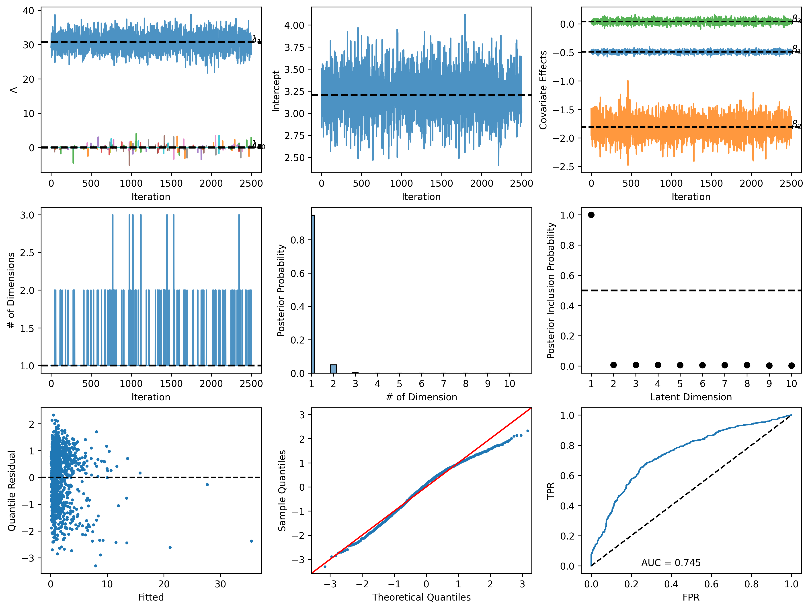

[](https://github.com/joshloyal/glnem/blob/main/LICENSE)

## A Spike-and-Slab Prior for Generalized Linear Network Eigenmodels (GLNEMs) 

*Author: [Joshua D. Loyal](https://joshloyal.github.io/)*

This package provides an interface for the model described in
"A spike-and-slab prior for dimension selection in generalized linear network eigenmodels." Inference is performed using
a Hamiltonian-within-Gibbs algorithm. For more details, see [Loyal (2024)]().

Dependencies
------------
``glnem`` requires:

- Python (>= 3.10)

and the requirements highlighted in [requirements.txt](requirements.txt). To install the requirements, run

```python
pip install -r requirements.txt
```

Installation
------------
You need a working installation of numpy, scipy, and jax to install ``glnem``. Install these required dependencies before proceeding.  Use the following commands to get the copy from GitHub and install all the dependencies:

```
>>> git clone https://github.com/joshloyal/glnem.git
>>> cd glnem
>>> pip install -r requirements.txt
>>> python setup.py develop
```

Example
-------

```python
import matplotlib.pyplot as plt

from glnem import GLNEM
from glnem.datasets import load_trees


# load tree network example
Y, X = load_trees()

# weighted adjacency matrix
Y.shape
#>>> (51, 51)

# dyadic covariates, shape (n_dyads, n_covariates)
X.shape
#>>> (1275, 3)

# initialize negative binomial GLNEM with a log-link and d = 10 latent features
glnem = GLNEM(family='negbinom', link='log', n_features=10)

# run the MCMC algorithm for 2,500 warm-up iterations and collect 2,500 post warm-up samples
glnem.sample(Y, X, n_warmup=2500, n_samples=2500)

# summary of the posterior distribution
glnem.print_summary()
#>>> sample: 100%|████████████████████████████████████████████████████████████████████████████████| 500/500 [00:29<00:00, 17.06it/s, 63 steps of size 8.06e-02. acc. prob=0.93]
#>>> sample: 100%|██████████████████████████████████████████████████████████████████████████████| 5000/5000 [02:01<00:00, 41.19it/s, 63 steps of size 9.46e-02. acc. prob=0.91]
#>>> WAIC: 3808.051
#>>> 
#>>>                   mean       std    median      2.5%     97.5%     n_eff     r_hat
#>>>           X1     -0.49      0.02     -0.49     -0.54     -0.44   5384.40      1.00
#>>>           X2     -1.81      0.18     -1.81     -2.14     -1.46   4928.38      1.00
#>>>           X3      0.04      0.04      0.04     -0.03      0.12   5778.22      1.00
#>>>   dispersion      0.53      0.06      0.53      0.42      0.64   5725.31      1.00
#>>>    intercept      3.21      0.25      3.20      2.71      3.70   4524.41      1.00
#>>>    lambda[0]     30.67      2.41     30.70     25.74     35.09   2382.81      1.00
#>>>    lambda[1]     -0.00      0.15      0.00      0.00     -0.00   2500.45      1.00
#>>>    lambda[2]      0.00      0.16      0.00     -0.00      0.00   2581.86      1.00
#>>>    lambda[3]     -0.00      0.09      0.00     -0.00      0.00   2466.78      1.00
#>>>    lambda[4]      0.00      0.12      0.00     -0.00     -0.00   2382.43      1.00
#>>>    lambda[5]     -0.00      0.15      0.00     -0.00     -0.00   1668.96      1.00
#>>>    lambda[6]      0.00      0.13      0.00      0.00      0.00   2501.39      1.00
#>>>    lambda[7]     -0.00      0.13      0.00     -0.00     -0.00   2500.01      1.00
#>>>    lambda[8]     -0.00      0.05      0.00      0.00      0.00   2500.66      1.00
#>>>    lambda[9]      0.00      0.11      0.00     -0.00     -0.00   2501.21      1.00
#>>>          psi      1.91      0.21      1.90      1.51      2.34   5349.34      1.00
#>>>     sigma[0]     13.22      2.62     13.03      8.38     18.38   5794.00      1.00
#>>>     sigma[1]      0.03      0.49      0.00      0.00      0.00   2524.81      1.00
#>>>     sigma[2]      0.03      0.49      0.00      0.00      0.00   2474.96      1.00
#>>>     sigma[3]      0.03      0.40      0.00      0.00      0.00   2121.25      1.00
#>>>     sigma[4]      0.03      0.44      0.00      0.00      0.00   2456.77      1.00
#>>>     sigma[5]      0.03      0.49      0.00      0.00      0.00   2296.47      1.00
#>>>     sigma[6]      0.02      0.29      0.00      0.00      0.00   2526.90      1.00
#>>>     sigma[7]      0.02      0.29      0.00      0.00      0.00   2525.15      1.00
#>>>     sigma[8]      0.01      0.24      0.00      0.00      0.00   2514.24      1.00
#>>>     sigma[9]      0.02      0.34      0.00      0.00      0.00   2362.61      1.00

# diagnostic plots
glnem.plot(Y_obs=Y)
plt.show()
plt.savefig("nb_diag.png", dpi=600, bbox_inches='tight')
```



Simulation Studies and Real-Data Applications
---------------------------------------------

The [scripts](scripts) directory includes the simulation studies and real-data application found in the article.
